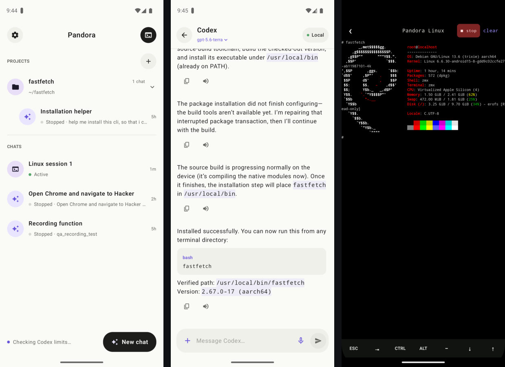

# Pandora

Pandora is a local, persistent AI-agent workspace for Android. It combines
durable Codex chats, project-aware workspaces, and a real Debian terminal in a
native Jetpack Compose app.

> [!IMPORTANT]
> Pandora is an early release for ARM64 Android devices. The embedded PRoot
> environment is not a VM or a security boundary.



## Todo / milestones

- [x] Linux Debian containers
- [x] Codex chats and persistent project storage
- [x] Agent skill for controlling the device
- [x] Easy onboarding
- [x] Dictation
- [x] Pandora can build itself
- [ ] Settings UX redesign
- [ ] BYOK, custom endpoints, and easy model setup and configuration for Codex
- [ ] Tablet UX
- [ ] Interactive voice mode
- [ ] Lower-latency voice-over
- [ ] Action-button and Bluetooth-remote dictation that works in the background for on-the-go, hands-free use

## Build

The project requires JDK 17 and Android SDK 35. It currently targets ARM64 devices only. If Android Studio ships a newer JDK, point `JAVA_HOME` at a JDK 17 installation for command-line builds.

```bash
./gradlew :app:assembleDebug
```

Install the resulting APK:

```bash
adb install -r app/build/outputs/apk/debug/app-debug.apk
```

Or build and install the latest local source on a connected physical device in one step:

```bash
./install-device.sh
```

When multiple physical devices are connected, pass the desired serial from `adb devices`:

```bash
./install-device.sh DEVICE_SERIAL
```

For an already-paired phone with Wireless debugging enabled, the script discovers it automatically. You can also connect directly with the IP address and debugging port shown on the Wireless debugging screen:

```bash
./install-device.sh 192.168.1.42:37123
```

To pair a phone for the first time, choose **Pair device with pairing code** and pass both the temporary pairing endpoint and the main debugging endpoint. The script prompts for the six-digit code:

```bash
./install-device.sh --pair 192.168.1.42:41257 192.168.1.42:37123
```

## Runtime model

The APK contains a Debian 13 (Trixie) ARM64 slim rootfs and a PRoot executable. On first container launch, the rootfs is extracted to the app's private files directory. `/root` is stored separately and mounted into the container, so Repair can replace damaged Linux system files without touching user projects, Codex, or Codex configuration. Repair resets non-default packages installed with `apt` and system-level configuration, then reapplies Pandora's versioned default package manifest.

This is a userspace Linux environment sharing Android's kernel, not a VM and not a security boundary. The shell is attached to a native PTY, so terminal sizing, signals, arrow keys, and interactive full-screen TTY programs behave normally.

Codex runs with `sandbox_mode = "danger-full-access"` because Android's PRoot environment cannot provide the user namespaces and `/proc/sys` access required by Bubblewrap. Codex commands can therefore read and modify the complete Pandora Linux workspace without an additional sandbox boundary.

Pandora also installs global Codex guidance at `/root/.codex/AGENTS.md` from the APK on first setup. These instructions give every chat and project basic context about Android, Debian, PRoot, persistent storage, Repair behavior, and runtime limitations. An existing file is left untouched so users can customize or replace the guidance, while project-level `AGENTS.md` files can add more specific instructions.

The local agent API is documented in [docs/agent-bridge.md](docs/agent-bridge.md).

Workspace backups are portable ZIP files containing the complete persistent `/root`. They therefore contain sensitive Codex and GitHub sessions and should be stored accordingly. Restore validates and extracts into staging before atomically replacing the current workspace.

Speech models are not bundled in the APK. Choose and download them from Settings → Voice. Downloads are stored in Pandora's private app storage, inference does not use the network, and each recognizer or voice engine is released after use to keep memory pressure low on older phones.

## License

Pandora is distributed under GPL-3.0-or-later. The bundled PRoot runtime is derived from the OpenMinis PRoot fork and is licensed under GPL-2.0. Debian packages retain their individual licenses. See `THIRD_PARTY_NOTICES.md`.

Contributions are welcome. Read [CONTRIBUTING.md](CONTRIBUTING.md), report
security issues through the process in [SECURITY.md](SECURITY.md), and see
[CHANGELOG.md](CHANGELOG.md) for release history.
